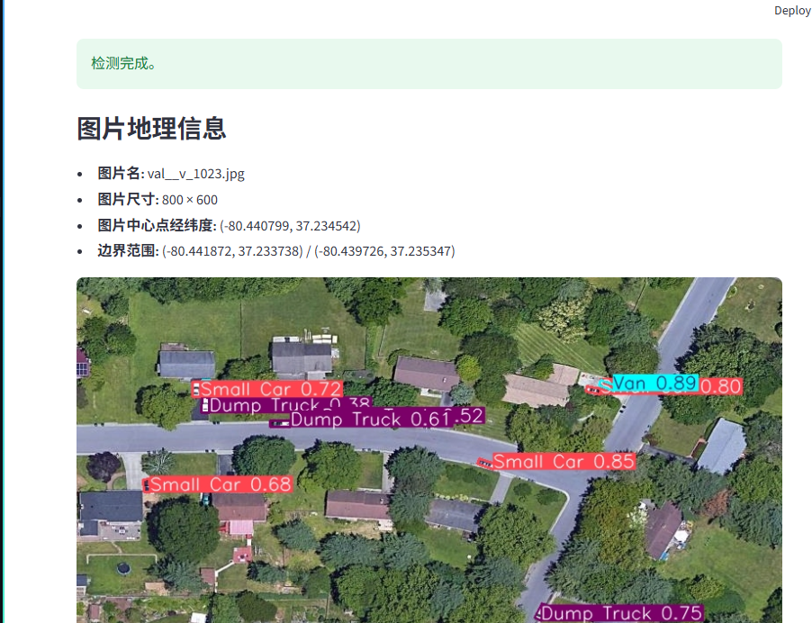

# YOLO OBB 样例图地理检测 Demo

这是一个基于 `sample_100_mix/` 样例图与 `yolo26n_obb_fair1m.pt` 权重的轻量 `Streamlit` demo。

## 效果图



## 功能

- 从 `sample_100_mix/` 中选择样例图
- 在选择区右侧实时预览当前选中图片缩略图
- 使用 OBB 模型执行单图检测
- 展示带检测框的结果图
- 展示图片中心点经纬度
- 展示最多 5 个检测框结果
- 每个检测框展示类别、置信度、像素中心点、经纬度中心点

## 项目结构

- `app.py`：`Streamlit` 页面入口
- `data_loader.py`：样例图与 `geo.json` 元数据读取
- `geo_mapper.py`：像素坐标到经纬度映射
- `inference.py`：YOLO OBB 推理与检测结果整理
- `sample_100_mix/`：样例图片与地理信息

## 环境准备

```bash
python -m pip install -r requirements.txt
```

## 运行方式

```bash
streamlit run app.py --server.address 0.0.0.0
```

启动后可在浏览器中打开 `Streamlit` 输出的地址。

## 使用说明

1. 在“样例图片”下拉框中选择一张图
2. 右侧预览区确认当前选中图片
3. 点击“开始检测”
4. 查看检测结果图、图片中心点经纬度与检测框详情

## 当前限制

- 仅支持 `sample_100_mix/` 目录中的样例图
- 不支持上传自定义图片
- 不返回检测框四角点经纬度
- 当前推理环境依赖本机已安装的 `torch`、`torchvision` 与 `ultralytics`

## 测试

```bash
python -m pytest tests/test_project_files.py tests/test_data_loader.py tests/test_geo_mapper.py tests/test_inference.py tests/test_app.py -q
```
